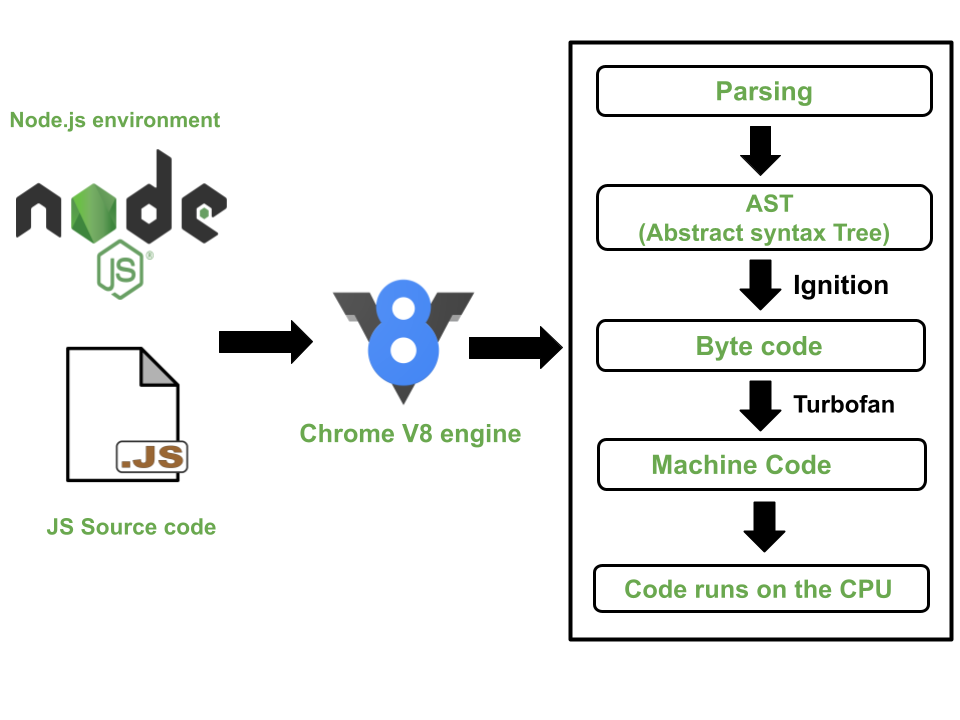
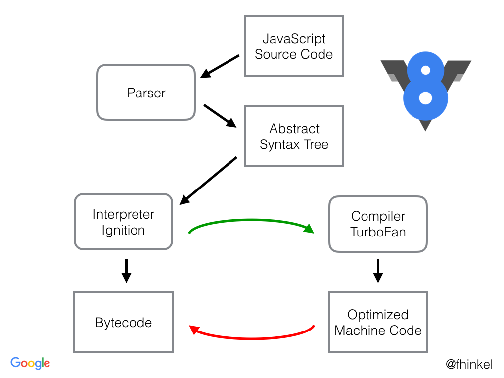

# V8 JavaScript Engine: Code Execution Phases

## 1. Parsing Stage
- **Lexical Analysis:** V8 reads the JavaScript code and breaks it down into tokens, which are small chunks like keywords, operators, and identifiers.
- **Syntax Analysis:** The tokens are then arranged into a structure called an Abstract Syntax Tree (AST), which represents the code's structure and logic.

## 2. Ignition (Interpreter)
- **Bytecode Generation:** V8 converts the AST into bytecode, a simpler, intermediate form of the code that’s easier to run.
- **Execution:** The Ignition interpreter runs this bytecode directly, allowing the code to start executing quickly, but not yet fully optimized.

## 3. Profiling
- **Hotspot Detection:** As the code runs, V8 watches for parts of the code that are used a lot, called "hot" functions. It gathers data on these parts to decide if they should be optimized.

## 4. TurboFan (Optimizing Compiler)
- **Optimization:** For the frequently used "hot" code, V8 uses the TurboFan compiler to turn the bytecode into highly optimized machine code, making it run much faster.
- **Deoptimization:** If the assumptions used to optimize the code turn out to be wrong (like a variable type changing), V8 can revert the code back to a slower, but safer, execution mode.

## 5. Garbage Collection
- **Memory Management:** V8 regularly cleans up memory by removing data that the program no longer needs, making sure that memory usage stays efficient.

## 6. Final Execution
- **Execution:** The optimized code continues to run efficiently until the program finishes or until changes in the code require adjustments.

This step-by-step process ensures that JavaScript code is executed as quickly and efficiently as possible.
"""
